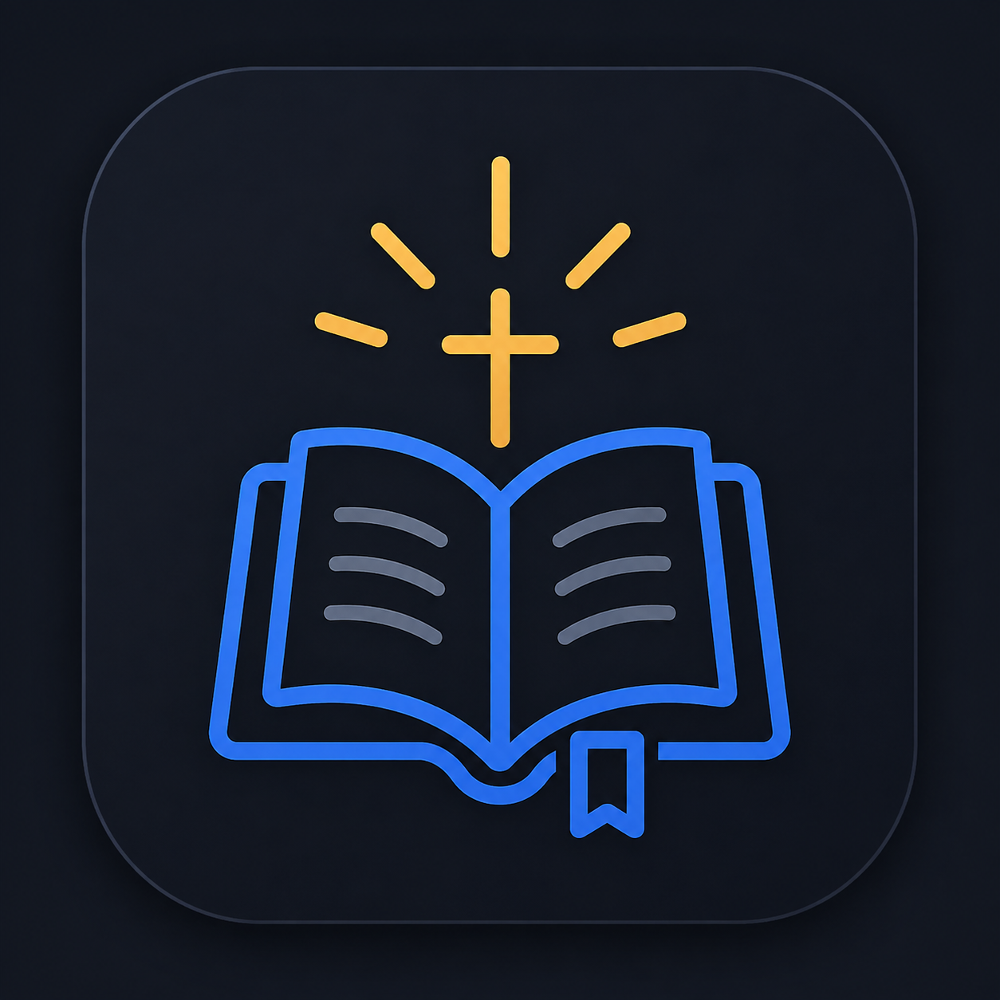

<p align="center">
  
</p>

<h1 align="center">Hello Bible</h1>

<p align="center">
  A quiet, native-feeling companion for reading and keeping a Bible verse without ever leaving VS Code.
</p>

<p align="center">
  <a href="https://marketplace.visualstudio.com/items?itemName=arturbomtempo-dev.hello-bible"></a>
  <a href="https://marketplace.visualstudio.com/items?itemName=arturbomtempo-dev.hello-bible"></a>
  <a href="https://marketplace.visualstudio.com/items?itemName=arturbomtempo-dev.hello-bible"></a>
  <a href="https://github.com/arturbomtempo-dev/hello-bible/stargazers"></a>
  <a href="LICENSE.md"></a>
</p>

---

## Why Hello Bible exists

Hello Bible was built as a hands-on exploration of the VS Code Extension API: webview views, view containers, `QuickPick`, event-driven state, all in service of producing something genuinely nice to have open every day. A small, contemplative space inside the editor, next to the file tree, that surfaces an encouraging verse without asking for any attention beyond a glance.

## Features

### Daily verse, right in the Explorer

A collapsible **Hello Bible** section sits at the bottom of the Explorer sidebar, alongside your file tree. It shows one verse per day: reference, text, and today's date, picked deterministically from a curated pool based on the calendar date. The pick resets exactly at midnight **in your own computer's local timezone**, not UTC, so the "today" you see always matches the today on your clock.

### Favorite the verses that matter to you

A single tap on **☆ Adicionar aos favoritos** saves the current verse; tap again to remove it. Favoriting is instant and syncs live between every screen of the extension, no reload required.

### A dedicated home for your favorites

An icon in the Activity Bar opens a panel listing every verse you've favorited, each with its reference, full text, and the date you favorited it, plus a one-click button to remove it. First time here with nothing saved yet? You get a friendly empty state instead of a blank panel.

### Make it yours

A gear icon in the "Hello Bible" section's title bar opens a picker with 8 curated accent colors, or "Padrão", which simply follows your editor theme's own link color. Whichever you choose drives the icon, divider, reference text, border, and background glow across **both** screens at once, live.

### One glance from anywhere

Run **Bible: Show Verse** from the Command Palette (`Ctrl+Shift+P` / `Cmd+Shift+P`) to see today's verse as a native notification, without opening the sidebar at all.

### Verses that are never hardcoded

Every verse's text is fetched live, in Portuguese, from a free public Bible API, never bundled or baked into the extension. The reference pool itself is a curated list of around 50 well-known, encouraging passages spanning both testaments, chosen specifically to keep the daily read motivational rather than random.

### Looks native in your theme

Every color in both webviews derives from VS Code's own theme variables, with sensible fallbacks, so Hello Bible looks at home in light, dark, high-contrast, and custom themes alike, with zero configuration.

## Built with

- **[TypeScript](https://www.typescriptlang.org/)**: the entire extension, strict mode on.
- **[VS Code Extension API](https://code.visualstudio.com/api)**: `WebviewView`, view containers, `QuickPick`, `EventEmitter`-driven reactivity.
- **[bible-api.com](https://bible-api.com)**: free, public, no API key, used for live verse text in the Portuguese Almeida translation.
- **[Vitest](https://vitest.dev/)**: unit tests for the service layer.
- **[ESLint](https://eslint.org/) + [typescript-eslint](https://typescript-eslint.io/)**: linting.
- **[Prettier](https://prettier.io/)**: formatting.

## Architecture

The codebase is organized by responsibility, so each layer can change independently:

```
src/
├── commands/    → Command Palette / QuickPick handlers
├── data/        → static curated data (verse references, accent colors)
├── models/      → shared TypeScript types
├── providers/   → VS Code webview controllers (wiring only, no HTML)
├── services/    → business logic and persisted state (favorites, accent color, verse fetching)
├── utils/       → small shared utilities (a dependency-free event emitter)
└── webview/     → pure functions that render HTML/CSS (no VS Code API in sight)
```

Providers never build HTML themselves; they call into `webview/`, which returns plain strings and knows nothing about VS Code. Services never touch the DOM. This keeps each layer testable and easy to reason about in isolation.

## Requirements

- Visual Studio Code `^1.125.0`.
- An internet connection, to fetch verse text from [bible-api.com](https://bible-api.com).

## Extension Settings

Hello Bible doesn't add anything to `settings.json`. Personalization (the accent color) is handled through the **Bible: Select Accent Color** command instead, reachable from the gear icon in the Explorer section's title bar.

## Known Issues

- Only one translation is available today (Portuguese, João Ferreira de Almeida).
- No offline caching: a verse can't be displayed without an internet connection.
- The curated reference pool (~50 verses) will keep growing in future releases.

## Roadmap

- More translations and languages.
- A larger, categorized reference pool.
- Insert the current verse directly into the active editor.
- An optional daily reminder/notification.

## Contributing

Contributions are welcome. To run the extension locally:

```bash
npm install
npm run compile
```

Then press `F5` in VS Code to launch an Extension Development Host with Hello Bible loaded.

Useful scripts:

- `npm run watch`: recompile on every change.
- `npm run lint`: run ESLint over `src`.
- `npm run format`: format the project with Prettier.
- `npm test`: run the unit test suite.

## Following extension guidelines

This extension follows the official Visual Studio Code extension guidelines.

- [Extension Guidelines](https://code.visualstudio.com/api/references/extension-guidelines)

## Author

Built by **Artur Bomtempo**.

- Website: [arturbomtempo.dev](https://www.arturbomtempo.dev)
- GitHub: [@arturbomtempo-dev](https://github.com/arturbomtempo-dev)
- LinkedIn: [in/artur-bomtempo](https://www.linkedin.com/in/artur-bomtempo/)
- Instagram: [@arturbomtempo.dev](https://www.instagram.com/arturbomtempo.dev)
- YouTube: [@ArturBomtempoDev](https://www.youtube.com/@ArturBomtempoDev)

## License

Released under the [MIT License](LICENSE.md).

**Enjoy!**
